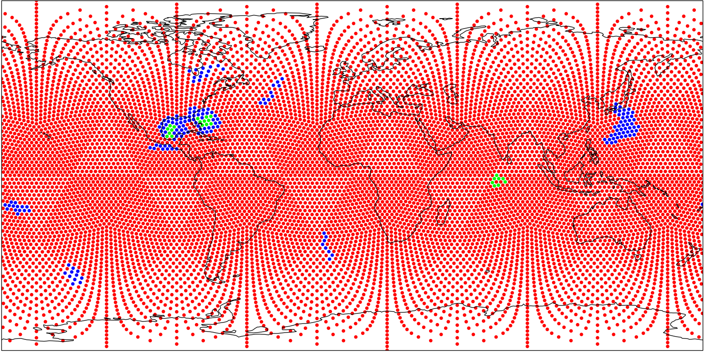
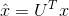
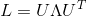
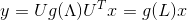
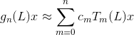
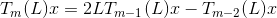
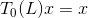
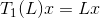

# DeepSphere: a graph-based spherical CNN

[](https://deepsphere.readthedocs.io/en/latest/?badge=latest)

This repository contains the PyTorch implementation of a novel methodology for applying [convolutional networks to spherical data through a graph-based discretization](https://openreview.net/pdf?id=B1e3OlStPB "This link takes you to the DeepSphere paper which was accepted at ICLR 2020").

- [Data](#data)
- [Quick Start](#quick-start)
- [Mathematical Background](#mathematical-background)
- [U-Net](#unet)
- [Temporality](#communication)
- [Metric](#metric)
- [Tools](#tools)

# Data

The data used for the experiments contains a [downsampled](http://island.me.berkeley.edu/ugscnn/data/climate_sphere_l5.zip "This link lets you download the downsampled dataset (~30 Gb). This can also be done using the script, described further down.")
snapshot of the [Community Atmospheric Model v5 (CAM5)](https://portal.nersc.gov/project/dasrepo/deepcam/segm_h5_v3_reformat/gb_data_readme "This link takes you to the page where the full dataset can be downloaded and where more information is provided concerning the data.")
 simulation. The simulation can be thought of as a 16 channel "image", where each channel corresponds to a climate related measurement.
The task is to learn how to infer the correct class for each pixel given the 16 channels. Each pixel is labelled either as background, as being part of a tropical cyclone or as being part of an atmospheric river.



# Quick Start

In order to reproduce the results obtained, it is necessary to install the PyGSP branch containing the graph processing for equiangular, icosahedron, and healpix samplings. In future versions, PyGSP will be in the requirements. Subsequently, please refer yourself to the [Pytorch Getting Started information page](https://pytorch.org/get-started/locally/) to run the correct `conda install` command corresponding to your operating system, python version and cuda version.
Once those requirements are met, you can install the `deepsphere` package in your environment.

Our recommendation for a linux based machine is:

```
conda create --name deepsphere python=3.7

source activate deepsphere

pip install git+https://github.com/Droxef/pygsp.git@6b216395beae25bf062d13fbf9abc251eeb5bbff#egg=PyGSP

conda install pytorch=1.3.1 torchvision=0.4.2 cudatoolkit=10.0 -c pytorch

pip install deepsphere
```

The package offers the experiment parameters stored in a [Yaml config file](./scripts/config.example.yml), which can be used by running a [script](./scripts/run_ar_tc_ignite.py) from the command line.

A special note should be made for the pytorch computation device. If nothing is stipulated in the command line, the device is set to CPU. To set the device to GPU (cuda) one can indicate `—gpu` in the command line, with or without the desired GPU device IDs (e.g. `--gpu 1 2`, if the model is supposed to run on the GPU 1 and 2).

To visualize any icosahedron or equiangular data the package provides a demonstration [Jupyter notebook](./notebooks/demo_visualization.ipynb) for data in 2D or 3D.

Using the predefined parameters you can train and validate the model using the following command:
```
python run_ar_tc.py --config-file config.example.yml --gpu
```

If you don't have the data yet, please add create the folder ```/data/climate/``` (or change the file location in the yaml file) and add ```download True``` to the command.
# Mathematical Background

The Deepsphere package uses the manifold of the sphere to perform the convolutions on the data. Underlying the application of convolutional networks to spherical data through a graph-based discretization lies the field of Graph Signal Processing (GSP). Graph Signal Processing is a field trying to define classical spectral methods on graphs, similarly to the theories existing in the time domain.

This section attempts to give the key concepts of the sphere manifold in the form of a graph, and how manipulating the data in the eigenvector space allows an optimal convolution operation on the sphere. For an in-depth introduction to the topic, see for example [Graph Signal Processing: Overview, Challenges and Applications (2017)](https://arxiv.org/abs/1712.00468) or [The Emerging Field of Signal Processing on Graphs (2012)](https://arxiv.org/abs/1211.0053). For simpler introductions to the matter, you may refer to [Chapter 1.2 of J. Paratte's PhD Thesis](https://infoscience.epfl.ch/record/231710?ln=en) or [Chapter 2.1 of L. Martin's PhD Thesis](https://infoscience.epfl.ch/record/234372?ln=en).
For an introduction to graph convolutions in the context of neural networks see for example [Convolutional neural networks on graphs with fast localized spectral filtering (2016)](http://papers.nips.cc/paper/6081-convolutional-neural-networks-on-graphs-with-fast-localized-spectral-filtering).

Following GSP paradigms, the convolution operator defined on graphs can be computed simply with a multiplication in the correct domain, just like classical signal processing. Indeed, in traditional signal processing, filtering (i.e., convolution) can be carried out by a pointwise multiplication as long as the signal is transformed to the Fourier domain. Thus, given a graph signal, we define its graph Fourier transform as the projection of the signal onto the set of eigenvectors of the graph Laplacian:

,

where *U* and *Λ* are the results of the eigendecomposition of the Laplacian, i.e.  .

To bring the data to the spectral domain several Laplacians could be used. We decide here that we select the combinatorial Laplacian,, which is simply defined as:

,

where *W* is the weighted adjacency matrix of the graph and *D* is the diagonal matrix composed of the degrees, the sum of the weights of all the edges for each node, on its diagonal.

Filtering, the convolution operator, is defined to this end via a graph filter called *g*, a continuous function directly in the graph Fourier domain, enabling the direct multiplication. Based on the definition of the graph Fourier domain, we can then rewrite the graph filtering equation as a vector-matrix operation in the original domain (the graph domain):

.

However, the filtering equation defined above involves the knowledge of the full set of eigenvectors U. Hence it implies the diagonalization of the Laplacian L which is extremely costly for large graphs. To circumvent this problem, one can represent the filter g as a polynomial approximation: the n-degree Chebyshev polynomials. The relation between the graph filter *g(L)*, the graph signal *x*, and the Chebyshev polynomials lies in the approximation:

,

where *c_m* are the coefficients of the approximation and describe entirely the shape of the graph filter *g*.

Since the Chebyshev polynomials of the first-kind are defined with the recurrence relation, the computation of the approximation is very efficient compared to diagonalization of L since it simply requires the computation of:

,

where  and .

Thus, learning the weights of the polynomial approximations makes it possible to learn generic graph filters. The convolution on a spherical graph comes down to backpropagating to tune the weights of the Chebyshev polynomials.

# Unet

The architecture used for the deep learning model is a classic [U-Net](https://arxiv.org/pdf/1505.04597.pdf). The poolings and unpoolings used correspond to three types of possible spherical samplings: [icosahedron](https://git.arcanite.ch/interns/climate/deepsphere/blob/5-temporality/deepsphere/layers/samplings/icosahedron_pool_unpool.py), [healpix](https://git.arcanite.ch/interns/climate/deepsphere/blob/5-temporality/deepsphere/layers/samplings/healpix_pool_unpool.py) and [equiangular](https://git.arcanite.ch/interns/climate/deepsphere/blob/5-temporality/deepsphere/layers/samplings/equiangular_pool_unpool.py).

# Temporality

Beyond reproducing in pytorch the ARTC experiment, we introduced a new dimension to our package: temporality. We did so following two approaches. First, we combined the U-Net with a recurrent neural network ([LSTM](https://en.wikipedia.org/wiki/Long_short-term_memory)) as presented in [Recurrent Fully Convolutional Network for Video Segmentation](https://arxiv.org/pdf/1606.00487v2.pdf).
Secondly we augmented the feature space of the U-Net, thus taking more than one sample as an input.

# Metric
The metric used to evaluate the performance of the model is the mean of the [average precision](https://scikit-learn.org/stable/modules/generated/sklearn.metrics.average_precision_score.html) of the classes "Atmospheric River" and "Tropical Cyclone". Only around 2% of the data is labelled as an atmospheric river and 0.1% of the data is labelled as a tropical cyclone. For such unbalanced datasets the average precision is an appropriate metric.
The average precision metric allows to circumvent to some extent the trade-off between precision and recall performance. Average precision computes the average precision value for recall values over the interval 0 to 1. In other words it measures the area under the Precision-Recall Curve in a piecewise constant discretization manner. For the model, using average precision over each class/label type gives a sense of how well the model's detection is performed in the case of an unbalanced dataset.

# Tools
- Ignite

Ignite provides a clean training-valdiation-testing loop. Through ignite, engines corresponding to a trainer, validator and tester for the model can be created. Properties of these engines can be set using Handlers. For example, the trainer can have a handler to print certain information during training, and the validator can have a handler to log the metrics or a handler to change the learning rate based on the metrics of the epoch.

- Tensorboard

Tensorboard allows to log metrics, training loss and learning rate rhythms. In the script, one can create a Summary Writer and attach to this object diverse saving options.

- Visualizations

Visualizations are possible in 2D and 3D. The 2D representation is a flattened version of the sphere with a 2D projection of the sampling used (at the moment, this is possible for the icosahedron and equiangular samplings). The 3D gif rendering allows to represent the lables on a turning world sphere. Finally, an interactive plotting notebook is also presented as an inspiration for interactive plots. It allows to plot the metrics at a point in training (for a certain epoch), alongside the predicted labels plotted in 2D. This prediction is opposed to the plot of the ground truths in 2D.
